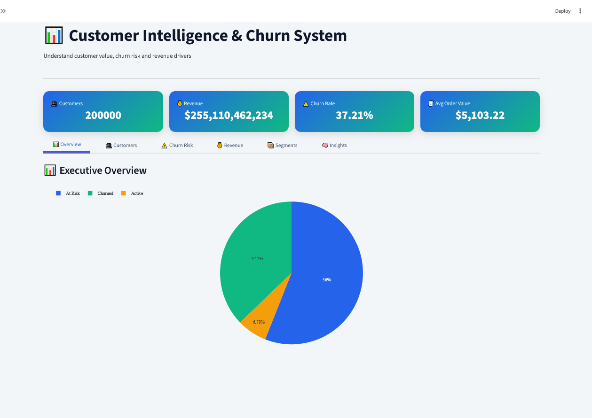
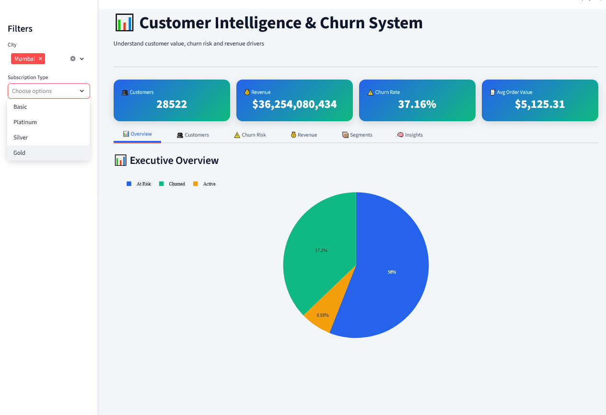

# Customer Churn Prediction

Machine learning application built with Streamlit to predict customer churn and analyze retention patterns.

## Overview

This project focuses on identifying customers who are likely to stop using a service (churn).  
It combines data analysis, machine learning, and interactive visualization to support business decision-making.

The application allows users to:
- Explore customer data
- Analyze churn distribution
- Train and evaluate a predictive model
- Generate churn predictions for new customers
- Visualize key patterns and insights

## Features

- Interactive data exploration
- Customer churn analysis
- Machine learning model (classification)
- Real-time predictions
- Visual dashboards with Plotly
- User-friendly Streamlit interface

## Tech Stack

- Python
- Streamlit
- Pandas
- Scikit-learn
- Plotly


## Screenshots
## Demo

### Dashboard 1


### Dashboard 2



## Model

This project uses a supervised classification model to predict churn probability based on customer features such as usage patterns, demographics, and behavior metrics.


Install dependencies:

```bash
pip install -r requirements.txt
```

Run the app:

```bash
streamlit run app.py
```

## Project Structure

```text
customer-churn-prediction/
│
├── data/
├── models/
├── images/
├── app.py
├── requirements.txt
└── README.md
```

## Future Improvements

- Improve model accuracy
- Add feature importance analysis
- Deploy API version (FastAPI)
- Add user authentication

## Author

Economics & Data Analytics Portfolio Project